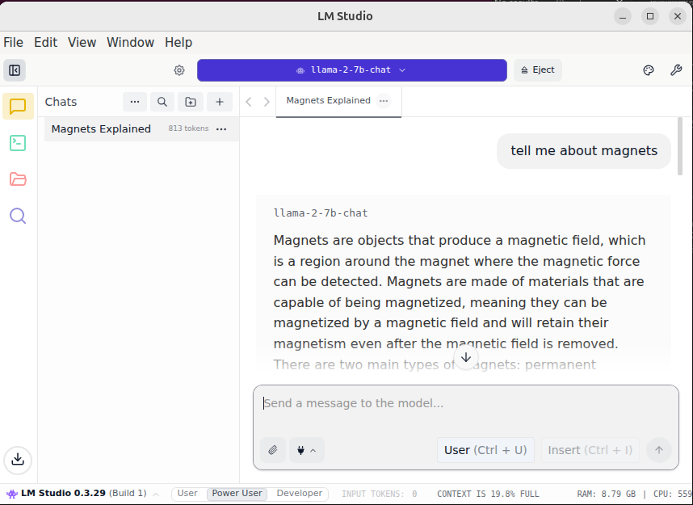

# LM Studio - Local LLM Development Environment



This Ryzer package installs and configures LM Studio, a desktop application for running local LLMs (Large Language Models) on your machine.

## Overview

LM Studio provides an easy-to-use interface for running language models locally without sending data to external servers. This package sets up LM Studio in a containerized environment with support for both GUI and headless server modes.

## Build and Run the Package
```bash
ryzers build lmstudio
ryzers run
```
The above commands run a test to check that the environment is ready for running LM Studio.

## Run Interactively

If you would like to run the session interactively, use:

```bash
ryzers run "lm-studio --no-sandbox"
```

## Run Headless
The `lms` CLI drives LM Studio without the GUI:

```bash
ryzers run bash
```

Then, inside the container:

```bash
lms get <model>                # download a model (e.g. gemma-4; then choose a variant)
lms ls                         # list local models
lms chat <model>               # chat with a model in the terminal
```

Notes:
- Run `lms runtime survey` to analyze the detected GPUs/VRAM.
- Use `/model` to change models when inside the chat.
- You may also start a chat with no model selected: `lms chat`.


## Volumes
- "$PWD/lmstudio_models" - this host path will cache LM Studio models so you don't have to download them every time.

## Troubleshooting

When using the GUI, loading some models - Gemma 4, for example - fails with:

```
Engine protocol runtime llama-server for <id> exited before becoming healthy.
exitCode=null, signal=SIGABRT
```

**Fix: turn off "Keep Model in Memory" in the model's advanced load settings.**


## LM Studio Webpages
- Official documentation: [https://lmstudio.ai/docs](https://lmstudio.ai/docs)


Copyright(C) 2025 Advanced Micro Devices, Inc. All rights reserved.