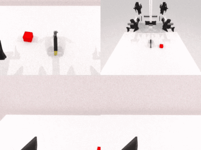

### RoboTwin 2.0

This package provides the RoboTwin 2.0 simulation base (SAPIEN offscreen Vulkan ray-tracing
renderer plus mplib motion planning) as a Ryzer on AMD Ryzen AI Max+ 395 (Strix Halo,
gfx1151) under ROCm 7.14. RoboTwin 2.0 is a dual-arm manipulation benchmark. The base exposes
a model-agnostic `sim_robotwin.Policy` seam, selected at runtime via `POLICY_FACTORY` (default
the built-in `RandomPolicy`), that WAM and VLA packages chain on for closed-loop and
interactive rollouts.

### Build

```sh
ryzers build robotwin
ryzers run     # test.py: ROCm torch + SAPIEN/mplib import sign-of-life
```

### Example: RoboTwin 2.0 with FastWAM

```sh
ryzers build robotwin fastwam --name fastwam-robotwin
ryzers run --name fastwam-robotwin /ryzers/demos/demo_closedloop_robotwin.sh
```

<p align="center">
  
  <br><em>FastWAM closed-loop rollout in RoboTwin 2.0 (beat_block_hammer task).</em>
</p>

### References

- Upstream: https://github.com/RoboTwin-Platform/RoboTwin (pinned via `RT_COMMIT` in the Dockerfile)

Copyright (C) 2026 Advanced Micro Devices, Inc. All rights reserved.
SPDX-License-Identifier: MIT
