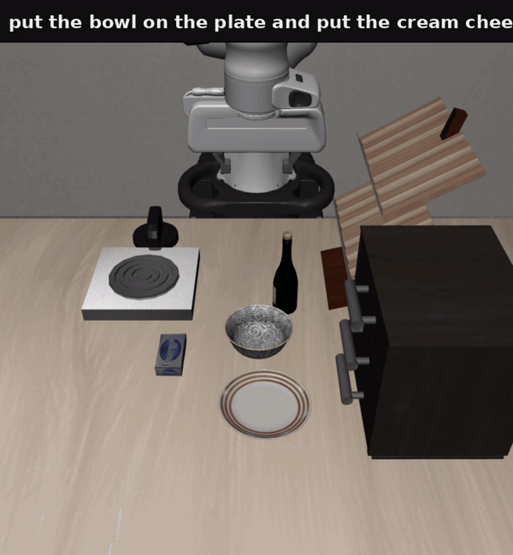
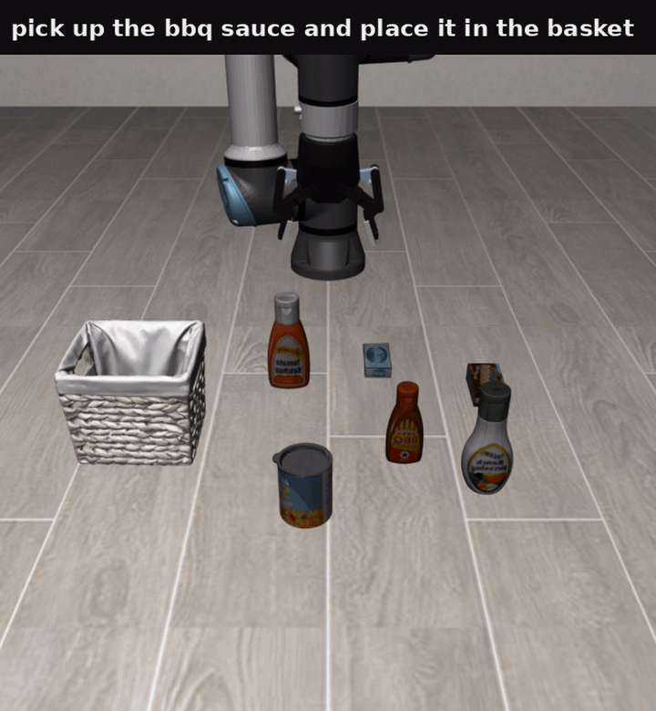
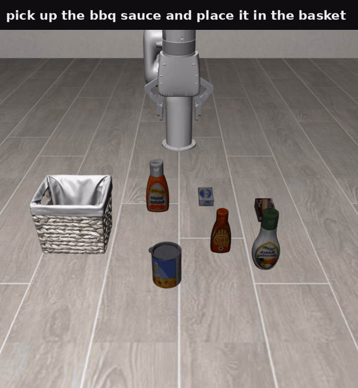

### MolmoAct2

This package runs [MolmoAct2](https://huggingface.co/collections/allenai/molmoact) VLA model on AMD Ryzen Al Max+ 395 (Strix-Halo Mini PC). Demos include

- a browser-based interactive LIBERO simulator with the panda robot arm.
- zero-shot cross-embodiment interactive demos for UR5e and xArm6 robot arms.


### Build

```sh
ryzers build molmoact2
ryzers run
ryzers run /ryzers/download.sh
```

`ryzers run` with no command is a light ROCm environment check. `download.sh`
preloads the MolmoAct2-DROID, MolmoAct2-DROID-Dataset, and
MolmoAct2-Think-LIBERO assets into the mounted cache.

Artifacts are written to `workspace/molmoact2/outputs`.

### Interactive Demo


To command a robot arm to do tasks in the LIBERO-mujoco simulation environment in a browser, run the interactive demo:

```sh
ryzers run /ryzers/demo_interactive.sh
```

Then from a browser, open `http://localhost:8080`.

The synchronous demo defaults to the fast path, i.e. skips depth reasoning. For the full depth reasoning model, pass `THINK=1`.

Complex synchronous task execution:



### Cross-Embodiment Interactive Demos

The policy action operates in the end-effector coordinates and a robot controller handles the joint movements using inverse kinematics, so the MolmoAct2 model easily transfers over to other robots inside the simulation. We include two examples here. 

#### UR5e with Robotiq85 gripper:

```sh
EMBODIMENT=ur5e ryzers run /ryzers/demo_interactive.sh
```




#### UR5e with Robotiq85 gripper:

```sh
EMBODIMENT=xarm6 ryzers run /ryzers/demo_interactive.sh
```



### Real-Time Interactive Option

The real-time server runs the sim at wall-clock speed while policy planning happens
asynchronously. The arm holds pose while the next action chunk is computed.

```sh
ryzers run /ryzers/demo_interactive_rt.sh
EMBODIMENT=ur5e ryzers run /ryzers/demo_interactive_rt.sh
EMBODIMENT=xarm6 ryzers run /ryzers/demo_interactive_rt.sh
```

Open `http://localhost:8081` in a browser to see how the robots behave in a real-time simulator setting. 

For long-horizon tasks in the real-time setting:

```sh
RT_HORIZON_MULT=10 ryzers run /ryzers/demo_interactive_rt.sh
```

### Closed-Loop LIBERO Evaluation

Run one closed-loop LIBERO rollout in MuJoCo:

```sh
ryzers run /ryzers/demo_libero.sh
SUITE=libero_object TASK_ID=3 ryzers run /ryzers/demo_libero.sh
```

Suites: `libero_10`, `libero_goal`, `libero_object`, `libero_spatial`.
`TASK_ID` is `0` to `9`.


### DROID Open-Loop Replay

Run MolmoAct2-DROID open-loop on a dataset episode:

```sh
ryzers run /ryzers/demo_droid.sh
EPISODE=42 ryzers run /ryzers/demo_droid.sh
```
The demo writes a scene video and a ground-truth versus prediction action plot.


### Useful Knobs

- `THINK=1` enables the full depth reasoning path.
- `THINK=0 NUM_STEPS=4` is the fast interactive default.
- `PORT=...` changes the browser port.
- `SEED=...`, `SUITE=...`, and `TASK_ID=...` make runs reproducible.

Copyright(C) 2026 Advanced Micro Devices, Inc. All rights reserved.
