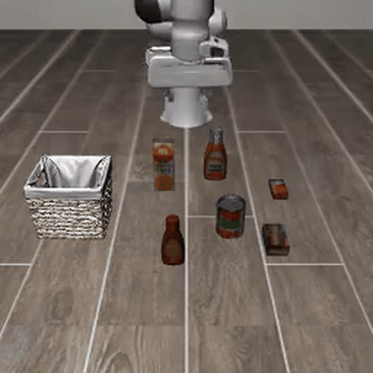
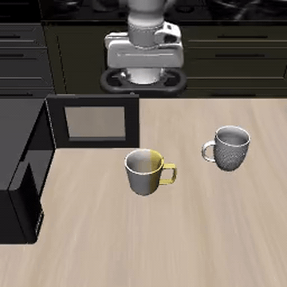

### MolmoAct2

This directory contains the Docker configuration files to run [MolmoAct2 from the Allen Institute for AI](https://huggingface.co/collections/allenai/molmoact) on AMD ROCm, validated on the Strix Halo `gfx1151` iGPU.

### Build and run

```sh
ryzers build molmoact2
ryzers run
```

`ryzers run` with no command runs an environment check (ROCm torch and deps, no weights). Weights and datasets download once into the persistent Hugging Face cache on first use. To pre-fetch them up front:

```sh
ryzers run /ryzers/download.sh
```

Demo artifacts (videos and plots) are written to `workspace/molmoact2/outputs`.

### Interactive demo



Type an instruction and watch the MolmoAct2-LIBERO policy run it in a live MuJoCo sim in your browser. **Send** resets the scene and runs the typed instruction, **Stop** halts it, **Randomize** loads a new scene.

```sh
ryzers run /ryzers/demo_interactive.sh        # open http://localhost:8080
```

The real-time variant runs the sim at wall-clock speed while the policy plans asynchronously, so the arm holds its pose while thinking and moves when the next chunk lands.

```sh
ryzers run /ryzers/demo_interactive_rt.sh     # open http://localhost:8081
```

Both default to the fast path (depth reasoning off, 4 denoising steps). On a remote box, forward the port first: `ssh -L 8080:localhost:8080 <host>`.

### Dataset evaluation (DROID open-loop)


Runs MolmoAct2-DROID open-loop on a DROID dataset episode and writes the scene video plus a ground-truth vs predicted action plot.

```sh
ryzers run /ryzers/demo_droid.sh              # random episode
EPISODE=42 ryzers run /ryzers/demo_droid.sh   # fixed episode
```

### Closed-loop evaluation (LIBERO)



Runs the MolmoAct2-LIBERO policy in the LIBERO MuJoCo simulator (EGL headless) and writes the rollout video plus the executed action plot.

```sh
ryzers run /ryzers/demo_libero.sh                              # random scene
SUITE=libero_object TASK_ID=3 ryzers run /ryzers/demo_libero.sh
```

Suites: `libero_10`, `libero_goal`, `libero_object`, `libero_spatial` (`TASK_ID` 0 to 9).

### Optional knobs

* `THINK=0` disables depth reasoning, about 2.6x to 2.9x faster end to end. The interactive demos default to this; pass `THINK=1` for full depth reasoning.
* `NUM_STEPS=N` sets flow-matching denoising steps (lower is faster). `NUM_STEPS=4` held 100% success.
* `RT_HORIZON_MULT=N` extends the real-time sim horizon so long tasks run to completion instead of resetting mid-execution.

`THINK` and `NUM_STEPS` both held 100% success in a `libero_object` sweep.

```sh
THINK=0 NUM_STEPS=4 ryzers run /ryzers/demo_libero.sh         # fast closed-loop
RT_HORIZON_MULT=10 ryzers run /ryzers/demo_interactive_rt.sh  # long-horizon real-time
```

Copyright(C) 2026 Advanced Micro Devices, Inc. All rights reserved.
