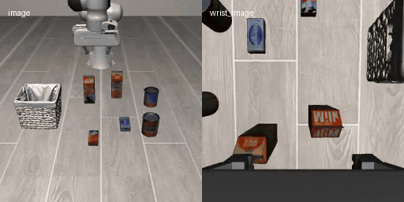
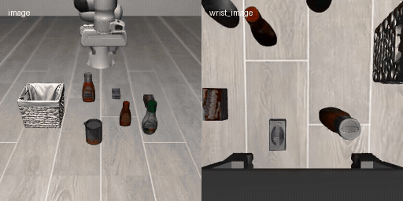
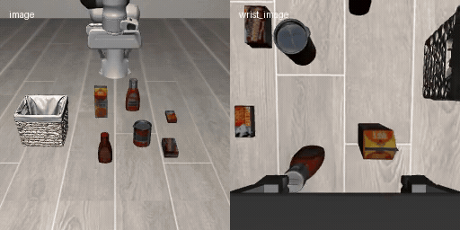
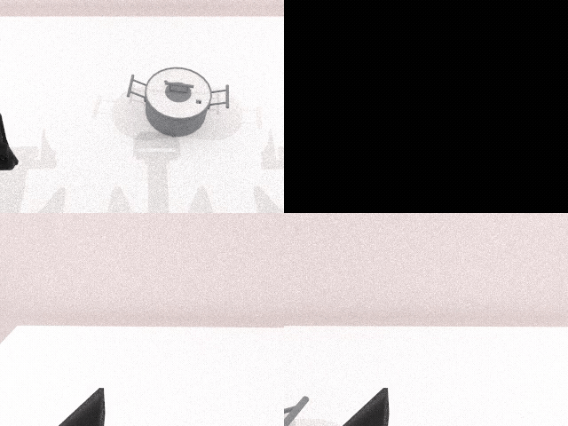
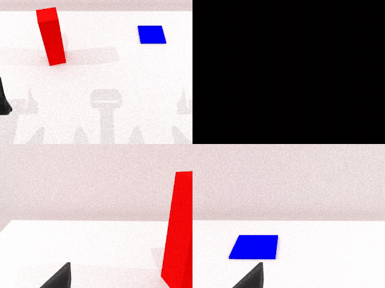
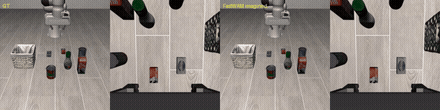
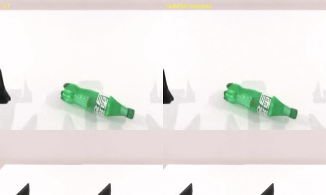

### FastWAM

This package runs [FastWAM](https://github.com/yuantianyuan01/FastWAM) on AMD Ryzen AI Max+ 395 (Strix Halo, gfx1151) under ROCm 7.14. FastWAM is a Wan2.2-TI2V-5B world-action model (T5 text encoder, Wan VAE, and a joint video/action DiT) that can plan actions with the video head skipped for speed, or imagine future frames alongside the action plan. It chains on top of a simulator base for closed-loop and interactive runs, or runs standalone on the plain base for the non-sim demos.

### Build

```sh
ryzers build fastwam --name fastwam                       # just model layer: non-sim demos (open-loop / videogen)
ryzers run --name fastwam                                 # test.py: ROCm torch + GPU + deps check
```

For building the image with simulation support, chain the appropriate simulation package to the build.
```
ryzers build simulation/libero   fastwam --name fastwam-libero     # chain the model on the LIBERO base
ryzers build simulation/robotwin fastwam --name fastwam-robotwin   # chain the model on the RoboTwin base
```

Artifacts are written to `workspace/*/outputs`. Set `HF_TOKEN` for faster or gated downloads.
The ~12 GB weights are fetched on the first model run.

```sh
ryzers run --name fastwam /ryzers/scripts/download_checkpoints.sh    # LIBERO + RoboTwin ckpts
```

### Interactive and closed-loop LIBERO

Drive the robot live in a browser, or run a batch rollout for a success rate. The interactive
server streams the MuJoCo view over HTTP and prints its `http://localhost:PORT` URL.

```sh
ryzers run --name fastwam-libero /ryzers/demos/demo_interactive_libero.sh      # live browser control
ryzers run --name fastwam-libero /ryzers/demos/demo_closedloop_libero.sh       # batch rollouts + success rate
```

Closed-loop libero task, rendered headless via EGL.

<p align="center">
  
  
  
  
  <br><em>Closed-loop LIBERO-object rollouts.</em>
</p>

With `VISUALIZE_FUTURE=true` the slow path also renders the imagined future next to the real
rollout (ground truth left, imagined right).

<p align="center">
  
  <br><em>Slow path: real rollout vs the model's imagined future.</em>
</p>

### Interactive and closed-loop RoboTwin 2.0

RoboTwin 2.0 runs under the SAPIEN Vulkan renderer.

```sh
ryzers run --name fastwam-robotwin /ryzers/demos/demo_interactive_robotwin.sh  # live browser control
TASKS="click_bell lift_pot" NUM_EPISODES=10 \
  ryzers run --name fastwam-robotwin /ryzers/demos/demo_closedloop_robotwin.sh # batch rollouts + success rate
```

<p align="center">
  
  
  
  
  <br><em>Closed-loop RoboTwin rollouts: beat block hammer, click bell, lift pot, handover block.</em>
</p>

### Video imagination

The joint path imagines the future video and actions together (ground truth left, imagined
right).

```sh
DATASET=libero ryzers run --name fastwam /ryzers/demos/demo_videogen.sh
```

<p align="center">
  
  
  <br><em>Ground truth vs imagined future, LIBERO (left) and RoboTwin (right).</em>
</p>


### References

- Upstream: https://github.com/yuantianyuan01/FastWAM
- Model: https://huggingface.co/yuanty/fastwam
- Datasets: https://huggingface.co/datasets/yuanty/LIBERO-fastwam, https://huggingface.co/datasets/yuanty/robotwin2.0-fastwam

Copyright (C) 2026 Advanced Micro Devices, Inc. All rights reserved.
SPDX-License-Identifier: MIT
